# Real-Time Banking Data Engineering Pipeline


A change-data-capture (CDC) pipeline for a simulated bank. Every insert, update and delete in a Postgres
database is captured from the write-ahead log, landed in object storage, loaded into Snowflake and modelled
with dbt into a tested star schema with SCD Type-2 history. A Power BI report sits on top.

A change in Postgres reaches the analytics tables in about **2–4 minutes**. Capture is streaming; the warehouse
load and transformations are micro-batches, so this is near-real-time rather than streaming analytics.

## Architecture

```mermaid
flowchart LR
    GEN[Python generator<br/>Faker] --> PG[(Postgres<br/>OLTP)]
    PG -- WAL / pgoutput --> DBZ[Debezium<br/>Kafka Connect]
    DBZ --> K[(Kafka topics)]
    K --> C[Python consumer, Docker<br/>batch + commit-after-write]
    C --> M[(MinIO<br/>Parquet, date-partitioned)]
    M -- Airflow: every 1 min<br/>PUT + COPY INTO --> RAW[(Snowflake RAW<br/>CDC event log)]
    RAW -- Airflow Dataset<br/>triggers dbt build --> STG[STAGING<br/>current state]
    STG --> AN[ANALYTICS<br/>snapshots · dims · facts · monitoring]
    AN --> PBI[Power BI]
```



| Stage | Mechanism | Latency |
| --- | --- | --- |
| Change capture | Postgres WAL → Debezium → Kafka | seconds |
| Landing | Kafka → consumer → MinIO | ~10 s batches |
| Warehouse load | Airflow → `PUT` + `COPY INTO` | ≤ 1 min |
| Transformation | Airflow Dataset → `dbt build` | ~1–2 min |
| Reporting | Power BI Import, scheduled refresh | per refresh |

## Data model (`BANKING.ANALYTICS`)

| Object | Grain |
| --- | --- |
| `FACT_TRANSACTIONS` | One row per transaction. A transfer is one row: `account_id` sends, `related_account_id` receives |
| `DIM_CUSTOMERS`, `DIM_ACCOUNTS` | One row per current customer / account (accounts carry the latest balance) |
| `DIM_DATE` | One row per calendar day |
| `DIM_CUSTOMERS_HISTORY`, `DIM_ACCOUNTS_HISTORY` | SCD Type-2 versions (`valid_from`, `valid_to`, `is_current`) |
| `FCT_ACCOUNT_BALANCE_CHANGES` | One row per observed balance change, built from CDC events |
| `FCT_CDC_EVENTS`, `MON_PIPELINE_FRESHNESS` | Pipeline monitoring: events by operation, ingest latency, freshness |

`RAW` keeps the append-only event log (one row per Debezium event plus `_FILE_NAME`, `_LOADED_AT`).
`STAGING` derives the current state of each record from it. dbt runs 49 data tests on every build
(46 generic tests in the `schema.yml` files + 3 singular tests in `banking_dbt/tests/`).

## Design decisions

- **Append-only RAW, CDC applied in dbt.** Loading events as-is keeps the full history and makes loads
  idempotent. Staging picks the latest version per key by Postgres LSN (falling back to Kafka offset) and
  removes records whose last event is a delete. Ordering by `created_at` doesn't work: every version of a
  row has the same `created_at`.
- **Commit Kafka offsets only after the MinIO upload succeeds.** Delivery is at-least-once; duplicates are
  removed in staging. On a failed upload the consumer seeks back instead of moving on.
- **`PUT` + `COPY INTO` instead of Snowpipe.** Snowflake can't reach a MinIO instance running locally, so
  files are pushed to a table stage. Snowflake's load history makes re-running a load safe.
- **Watermark on MinIO `LastModified`.** The load DAG only downloads new files, and skips without connecting
  to Snowflake when nothing is new, so the warehouse can suspend.
- **A failed file fails the load.** `COPY` uses `ON_ERROR = 'SKIP_FILE'` so one bad file doesn't block the
  others, but every result row is checked by column name: any status other than `LOADED` / `LOAD_SKIPPED`
  (or a `PUT` that isn't `UPLOADED` / `SKIPPED`) fails the task *before* the watermark moves. Airflow
  retries, and later runs rediscover the file, so nothing is silently dropped.
- **Key-pair auth with a least-privilege role.** Airflow and dbt log in as a `TYPE = SERVICE` user with a
  private key and `BANKING_PIPELINE_ROLE` (usage on one warehouse and database, create/insert in `RAW`,
  create views/tables in `STAGING` / `ANALYTICS`). CD uses its own `BANKING_CI_USER` / `BANKING_CI_ROLE`.
  No passwords and no `ACCOUNTADMIN` at runtime ([`snowflake/security_setup.sql`](snowflake/security_setup.sql)).
- **Consumer in Docker, testable by design.** The consumer runs as a compose service and handles `SIGTERM`
  (flush, then commit) so `docker stop` loses nothing. Kafka and S3 clients are injected, so the flush /
  commit / rewind logic is unit-tested with fakes; CI runs ruff, pytest and an offline `dbt parse`.
- **Balance is not an SCD2 attribute.** It changes on every transaction, so versioning it would create a new
  dimension row per transaction. Balance history lives in `FCT_ACCOUNT_BALANCE_CHANGES`; SCD2 tracks
  descriptive attributes (email, account type).
- **Money as exact decimals end to end.** Debezium sends decimals as strings, and dbt casts them to
  `NUMBER(18,2)`, avoiding floating-point rounding.
- **Dataset-driven dbt.** `dbt build` runs when new RAW data lands, instead of on a fixed schedule.

## Problems I hit and fixed

| Symptom | Root cause | Fix |
| --- | --- | --- |
| Every `transaction_type` was NULL | Staging read `v:txn_type`; the source column is `transaction_type` | Fixed the path; added `not_null` / `accepted_values` tests |
| Amounts arrived as `"AK3n"` | Debezium's default `precise` decimal mode sends base64 bytes in JSON | `decimal.handling.mode = string` |
| Consumer re-read everything on restart | `OffsetAndMetadata` takes 3 arguments in newer kafka-python, so the commit always failed | Version-aware commit; rewind on failure |
| New files stopped loading | `list_objects_v2` returns at most 1,000 keys and wasn't paginated | Paginator + watermark |
| Kafka container kept exiting | ZooKeeper still held the old broker registration (`NodeExists`) after a quick restart | Restart policy + healthchecks |
| `DIM_CUSTOMERS` had account rows | The model selected from the accounts snapshot | Rebuilt from customers staging |
| Two customers named "Steven Smith" merged in charts | Names aren't unique | `CUSTOMER_LABEL` (name + id) with a `unique` test |

## Known limitations

- Single Kafka broker with ZooKeeper, and no schema registry (JSON without schemas).
- A file that fails `COPY` every time (e.g. a corrupt Parquet file) keeps the load task failing and the
  watermark from advancing until it is fixed or removed from MinIO; it is never skipped automatically.
- The CI role inherits the pipeline role, so CD has the same Snowflake privileges as Airflow (a separate
  identity, not a narrower one).
- Python tests are unit tests with fakes; no end-to-end test of the Docker stack runs in CI.
- Power BI uses Import mode, so the report is as fresh as its last refresh.

## Failure behaviour

| Failure | What happens | Recovery |
| --- | --- | --- |
| A file fails `COPY` | Other files in the same `COPY` still load. `load_snowflake` fails, naming the file and Snowflake's `first_error`; the watermark is not advanced | Airflow retries once after 1 min; later runs rediscover the file. Load history skips files already loaded, so nothing is duplicated |
| MinIO is down while the consumer uploads | The upload raises; Kafka offsets are **not** committed; the consumer seeks back to the batch's first offsets and retries after 5 s | Resumes by itself when MinIO is back. At-least-once: duplicates are removed in staging |
| Snowflake login fails (missing or wrong key, missing grant) | `load_snowflake` fails before any `PUT`; a missing key file fails with the expected path in the message. The watermark is not advanced | Fix the key or grant; the next run loads everything since the last watermark |
| A dbt test fails | `dbt build` marks it as an error and skips everything downstream, so the marts keep their last good version. Relationship tests are `warn` (late-arriving rows) | Fix the data or model; the next load re-triggers `dbt build` |

## Repository layout

```text
.github/workflows/   ci.yml (ruff + pytest + offline dbt parse, no secrets), cd.yml (dbt build on main, key-pair auth)
banking_dbt/         dbt project: staging, snapshots, marts, monitoring, tests, macros
consumer/            kafka_to_minio.py: Kafka → MinIO Parquet writer; Dockerfile, pinned requirements.txt
data-generator/      faker_generator.py: balance-aware banking simulator (live + backfill)
docker/dags/         minio_to_snowflake_dag.py, dbt_banking_build.py
docs/                RUNBOOK.md (run & test)
kafka-debezium/      register_connector.py: creates/updates the Debezium connector
postgres/            schema.sql: source DDL (constraints, indexes, CDC settings)
powerbi/             measures.dax
snowflake/           security_setup.sql (role, service users), Power BI setup, cleanup and verification SQL
tests/               pytest unit tests for the consumer and the load DAG (no Docker or Snowflake needed)
keys/                Snowflake private keys from `make snowflake-keys` (git-ignored)
Makefile             snowflake-keys: generate the key pair and print the ALTER USER statement
docker-compose.yml   Postgres, Kafka, Debezium, MinIO, consumer, Airflow
**/.env.example      placeholders for every .env file
```

Tests: `pip install -r requirements-dev.txt && pytest` (coverage for the consumer and the load DAG is printed).

## Running it

- [docs/RUNBOOK.md](docs/RUNBOOK.md): Snowflake key-pair setup, start the stack, verify each hop, and run
  hands-on CDC tests (insert, update, SCD2, delete, storage outage, idempotent reload).
